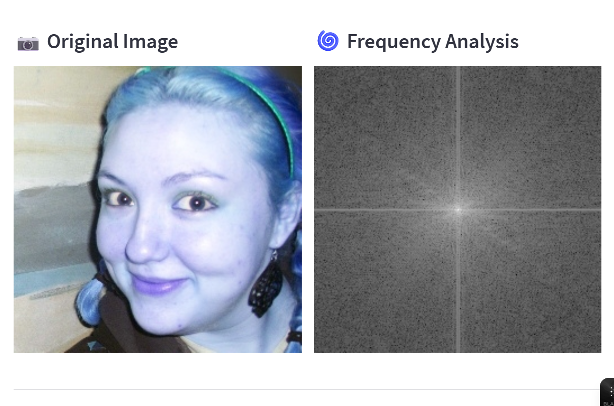
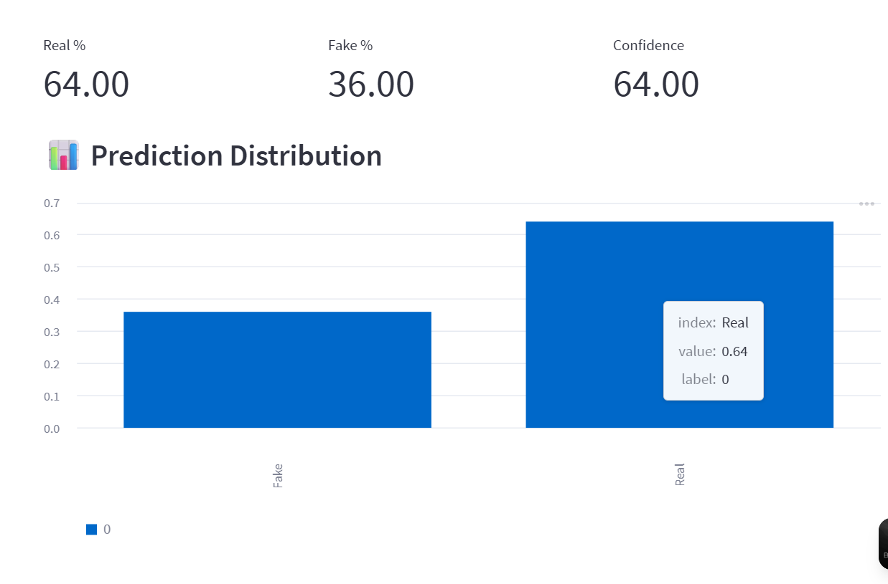
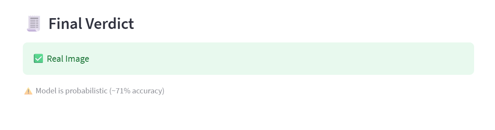

# 🛡️ Deepfake Detection System (Frequency-Based Approach)

## 📌 Overview

This project presents a **Deepfake Detection System** that analyzes images using **frequency domain features (FFT)** and machine learning techniques to distinguish between real and AI-generated (deepfake) images.

Unlike heavy deep learning models, this implementation focuses on a **lightweight, interpretable, and fast approach**, making it suitable for real-time applications and low-resource environments.

---

## 🎯 Objectives

* Detect deepfake images using **image processing + ML**
* Provide **real-time predictions via a web interface**
* Build a system that is **efficient, explainable, and deployable**

---

## 🧠 Methodology

### 1. Image Processing

* Input image is converted and preprocessed
* Face and texture regions are analyzed

### 2. Frequency Analysis (Core Idea)

* Fast Fourier Transform (FFT) is applied
* Extracts hidden frequency patterns often present in deepfakes

### 3. Feature Extraction

* Statistical and frequency-based features are computed
* Features are normalized using a scaler

### 4. Machine Learning Model

* **Random Forest Classifier**
* Trained to classify:

  * ✅ Real Images
  * ❌ Fake Images

---

## 🖥️ Application Interface

A **Streamlit-based dashboard** allows users to:

* Upload an image
* View frequency analysis (FFT)
* See prediction probabilities
* Get final classification (Real/Fake)

---

## 📸 Screenshots

### 🏠 Home Screen


### 📤 Upload & Analysis



### 📊 Prediction Metrics



### 🧾 Final Result



---

## ⚙️ Tech Stack

* **Python**
* **Streamlit** (UI)
* **OpenCV** (Image Processing)
* **NumPy**
* **Scikit-learn**
* **Joblib**

---

## 📂 Project Structure

```
deepfake-detector/
│
├── app.py                  # Streamlit application
├── model/
│   ├── model.pkl          # Trained model
│   └── scaler.pkl         # Feature scaler
├── utils/
│   ├── features.py        # Feature extraction
│   └── fft.py             # FFT computation
├── assets/                # Screenshots
├── requirements.txt
└── README.md
```

---

## 🚀 How to Run Locally

### 1️⃣ Clone the repository

```
git clone https://github.com/your-username/deepfake-detector.git
cd deepfake-detector
```

### 2️⃣ Install dependencies

```
pip install -r requirements.txt
```

### 3️⃣ Run the application

```
streamlit run app.py
```

---

## 📊 Model Performance

* Accuracy: **~71%**
* Model: Random Forest Classifier
* Approach: Frequency-based detection

> ⚠️ Note: Performance depends on dataset quality and diversity.

---

## 🔬 Future Improvements

* Integrate **CNN-based deep learning model (85%+ accuracy)**
* Add **video deepfake detection**
* Improve dataset size and diversity
* Deploy as a **web application (cloud-based)**

---

## 💡 Key Insight

Deepfake images often contain **subtle frequency inconsistencies** that are not visible to the human eye but can be detected using FFT-based analysis.

---

## 🎓 Use Case

* Academic research
* Cybersecurity awareness
* Media authenticity verification
* AI-generated content detection

---

## 🙌 Acknowledgment

This project was developed as part of an academic and research initiative in **Artificial Intelligence and Computer Vision**.

---

## 📬 Contact

For queries or collaboration:

* Name: *Nyasha Singh*
* Field: AI / Machine Learning
* GitHub: https://github.com/nyasha-r

---

⭐ If you found this project useful, consider giving it a star!
